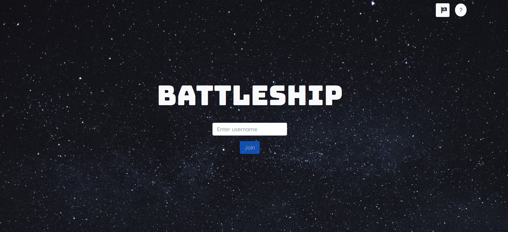
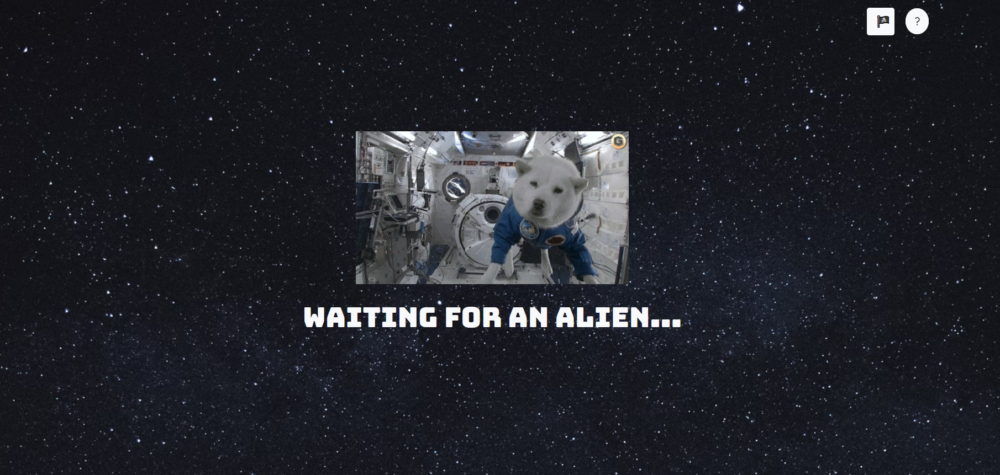
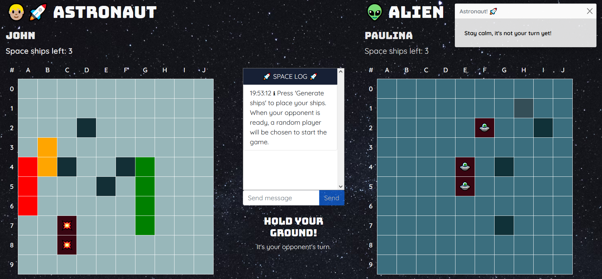
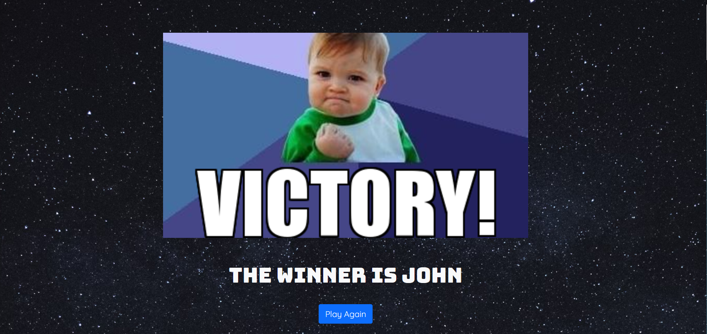
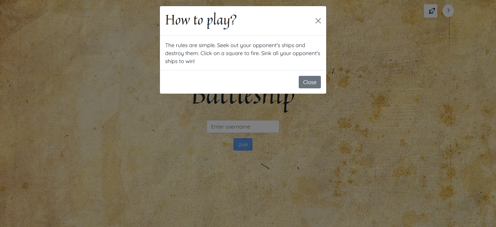
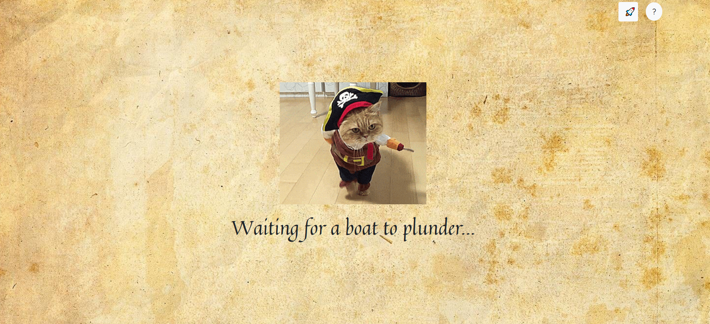
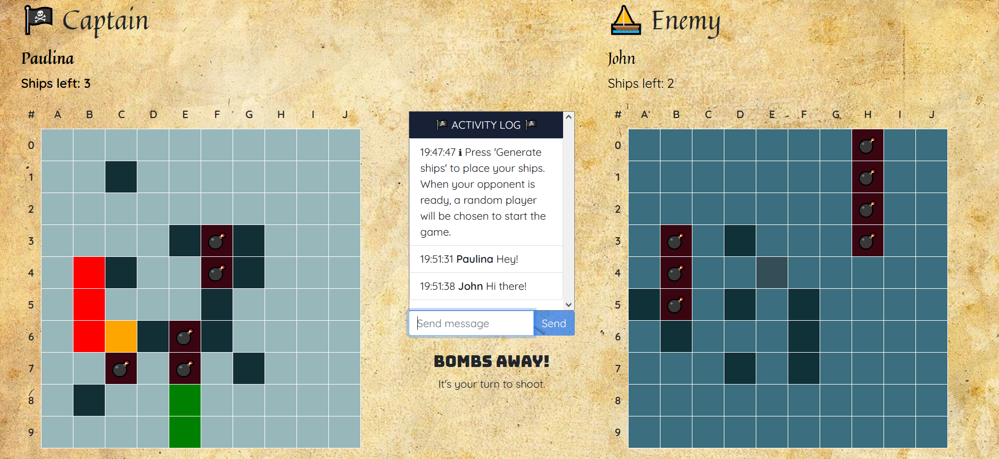
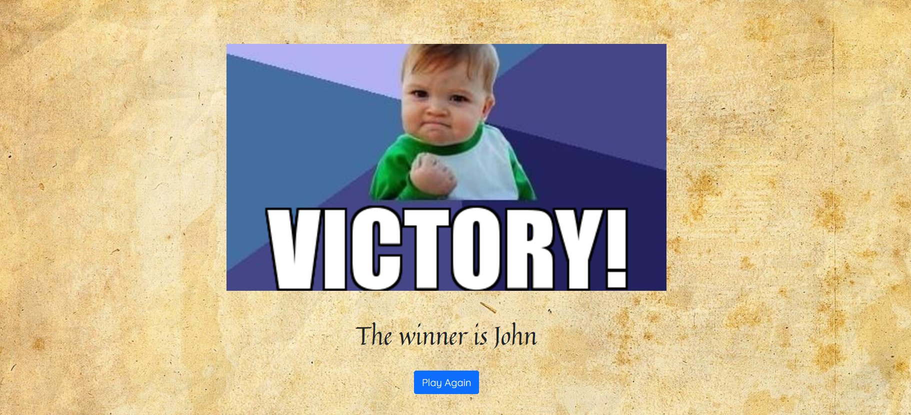

# battleship-client

Client side of [battleship game](https://fed21-battleship.netlify.app/) built using [React.js](https://reactjs.org/).

## Table of contents
* [Requirements](#requirements)
* [Screenshots](#screenshots)
* [Timeline](#timeline)

## Requirements

- two 10x10 battle boards, one for each player
- 4 ships per player (1x4 squares, 1x3 squares and 2x2 squares)
- players should fire shots by clicking on a square
- a player should only be able to click on a given square once
- players should only be able to fire a shot when it's their turn
- game ends when a player has sunk all of their opponent's ships
- a ship is 'sunk' when all the squares it occupies have been hit
- hits and misses should be displayed
- number of ships left should be displayed
- players should be able to submit a username
- multiple games should be able to run at the same time
- players should be able to chat with one another

## Screenshots

### Space theme

#### Login view

#### Waiting screen

#### Game view

#### Winner screen

### Pirate theme

#### Login view

#### Waiting screen

#### Game view

#### Winner screen

## Timeline

3 weeks
